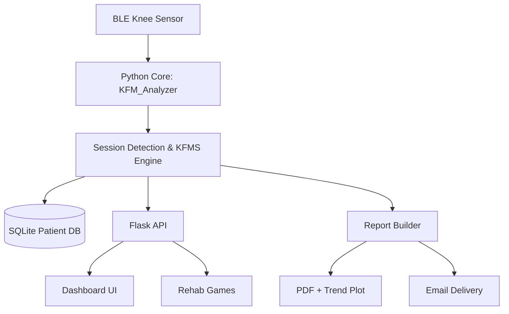

# 🦿 Knee Flexion Monitor (KFM)

A real-time rehabilitation monitoring platform that connects a BLE knee sensor to a Python analytics backend and an interactive Flask dashboard.

It captures motion sessions, computes a custom **Knee Flexion Monitor Score (KFMS)**, stores patient history, generates clinical-style PDF reports, and includes gamified training modes.


---

## ✨ Portfolio Highlights

- **End-to-end product build**: sensor ingestion → analytics → web dashboard → reporting.
- **Real-time data pipeline** using `bleak` notifications and async processing.
- **Clinical-style scoring model** combining range of motion, endurance, and movement control.
- **Applied UX design** with interactive dashboard and two rehab mini-games.
- **Automated reporting** with trend plots and PDF summaries.

---

## 🧠 What the system does

1. Connects to a BLE knee flexion device (`KneeFlexSensor`).
2. Streams angle, max-angle, and hold-time characteristics.
3. Detects sessions when angle crosses a configurable flex threshold.
4. Computes:
   - **Stability index** from angle variance,
   - **KFMS score** from weighted ROM/endurance/control components.
5. Persists sessions in patient-specific SQLite databases.
6. Exposes live and historical data via Flask endpoints.
7. Generates PDF reports and optionally emails them.

---

## 🧮 KFMS model (current implementation)

The score is capped to 100 and uses weighted components:

- `ROM = (max_angle / target_angle) * alpha`
- `Endurance = (hold_time / target_duration) * beta`
- `Control = stability_index * gamma`
- `KFMS = min((ROM + Endurance + Control) * 100, 100)`

Default weights in code:

- `alpha = 0.4`
- `beta = 0.4`
- `gamma = 0.2`

> Note: a progression-factor helper exists in code but is not currently applied to the returned KFMS value.

---

## 🏗️ Architecture



Mermaid source diagrams are also included under `mermaid_diagrams/`.

---

## 🧱 Tech Stack

- **Backend**: Python, `asyncio`, Flask
- **BLE**: `bleak`
- **Data**: SQLite, NumPy, Pandas
- **Visualization**: Matplotlib
- **Reporting**: ReportLab (PDF)
- **Frontend**: HTML/CSS/JS templates

---

## 📁 Project Structure

```text
KFM project/
├─ KFM_DTTv8.py                 # Main system (BLE + analytics + Flask + reports)
├─ requirements.txt             # Python dependencies
├─ templates/                   # Dashboard and game pages
├─ static/                      # Web assets (images/icons)
├─ reports/                     # Generated reports and plots
├─ mermaid_diagrams/            # Architecture/process diagrams (.mmd)
├─ generate_mermaid_pngs.py     # Mermaid file generator
└─ Final_code/Final_code.ino    # Embedded/firmware-side code snapshot
```

---

## 🚀 Quick Start

### 1) Clone and enter project

```bash
git clone <your-repo-url>
cd "KFM project"
```

### 2) Create and activate virtual environment

```bash
python -m venv .venv
.venv\Scripts\activate
```

### 3) Install dependencies

```bash
pip install -r requirements.txt
```

### 4) Run the system

```bash
python KFM_DTTv8.py
```

Then open:

- `http://localhost:5000`

---

## 🔌 Configuration

Key runtime parameters are defined at the top of `KFM_DTTv8.py`:

- `BLE_CONFIG`: BLE address, UUIDs, retry/timeout strategy
- `KFMS_PARAMS`: scoring targets, weights, flex threshold
- `SAFETY_LIMITS`: max allowable angle and hold time
- `EMAIL_CONFIG`: SMTP and recipient details for report sending

---

## 🌐 Main Endpoints

- `/` → dashboard
- `/current_data` → live telemetry JSON
- `/history` → session history JSON
- `/game-1` and `/game-1/data` → rocket game + live angle data
- `/game-2` → car game
- `/setup` → patient/session configuration
- `/set_position` → switch sitting/lying mode
- `/prescribed_exercises` → generated exercise prescription payload
- `/shutdown` → graceful stop and report finalization

---

## 📄 Reporting Outputs

Generated in `reports/`:

- **KFMS trend plots** (`*_kfms_plot_YYYYMMDD.png`)
- **PDF summaries** (`KFMReport_<patient>_<timestamp>.pdf`)

PDF contents include:

- rehabilitation classification table,
- historical session table,
- aggregate averages and variability,
- legal disclaimer section.

---

## 🧪 Suggested Demo Flow (for portfolio presentation)

1. Start app and open dashboard.
2. Simulate or stream knee angle data over BLE.
3. Show live angle/max/hold rings updating.
4. Trigger a full session (cross threshold, then return).
5. Open session history and explain KFMS trend.
6. Generate a report and show resulting PDF output.
7. Navigate to both mini-games to demonstrate engagement layer.

---

## 🔐 Security & Production Notes

This repository is currently structured as a prototype/research build.

Before production use:

- move email credentials to environment variables,
- rotate any exposed credentials,
- add authentication/authorization to web endpoints,
- add audit logging and stricter input validation,
- containerize deployment and externalize config.

---

## 🧭 Roadmap Ideas

- Clinician login and role-based access
- Time-series dashboard charts in-browser
- Structured API docs (OpenAPI/Swagger)
- Unit/integration tests for scoring and callbacks
- Docker deployment profile

---

## ⚠️ Disclaimer

The Knee Flexion Monitor is a development project for educational/research use and is **not a certified medical device**.

---

## 👤 Author

Developed as part of a wearable health-tech rehabilitation project.

If you’re using this as a portfolio piece, add your name, role, and links here:

- Name: *Your Name*
- LinkedIn: *your-link*
- Portfolio: *your-link*
